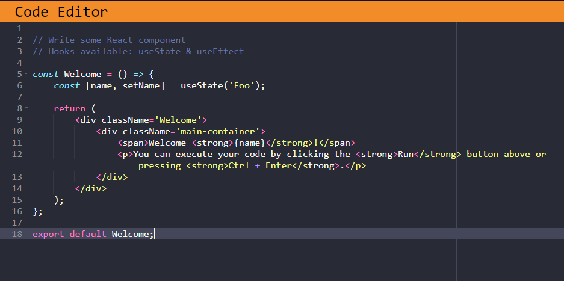
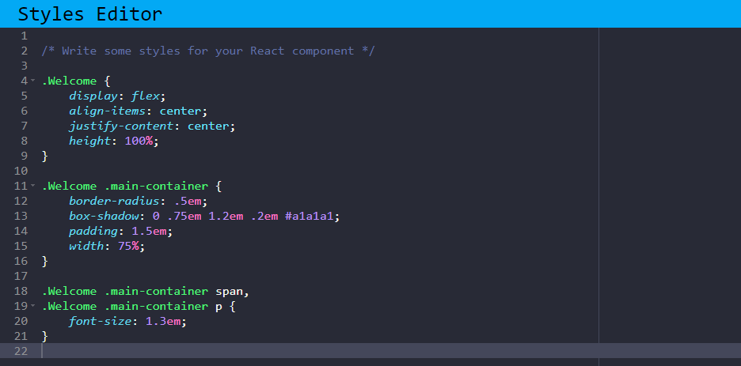
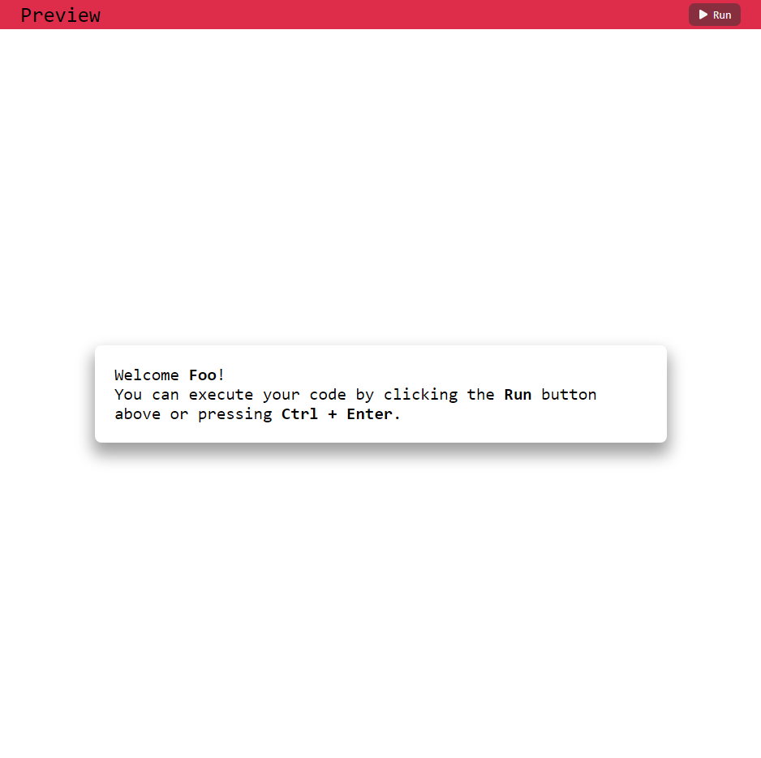

# React Component Preview
This project is an interactive webpage that allows users to write code in React and CSS in two separate editors. Once the code is written, you can render the preview to see the final result reflected live.

## Features
React Code Editor:


CSS Code Editor:


Live Preview:


## Technologies Used
* **React:** The main framework for building the component logic.
* **Vite:** A fast build tool used to bundle and serve the project.
* **Ace Editor:** Integrated code editors for an interactive coding experience.
* **HTML5 and CSS3:** As the foundation for the page structure and general styles.
* **GitHub Pages:** For deploying the project online.

## Installation and Setup
1. Clone the repository
```
git clone https://github.com/alexns-dev/react-code-editor-preview.git
```
2. Install dependencies
```
cd react-code-editor-preview
npm install
```
3. Start the Local Server
```
npm run dev
```

## Deployment
This project is deployed using GitHub Pages. You can view the live version at:
[React Component Preview](https://alexns-dev.github.io/react-code-editor-preview/)
